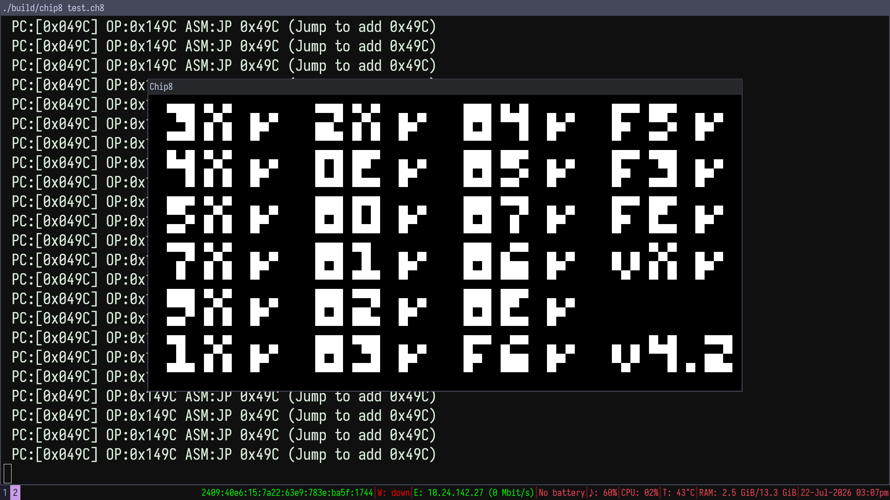

# CHIP-8



## Prerequisites
- GCC 
- SDL2

## Building
```bash
$ make # build
$ ./build/chip8 <path-to-rom>
```

## Key Mapping

```txt
 1  2  3  4 
 Q  W  E  R 
 A  S  D  F 
 Z  X  C  V 

# ESC: Exit the emulator
```
